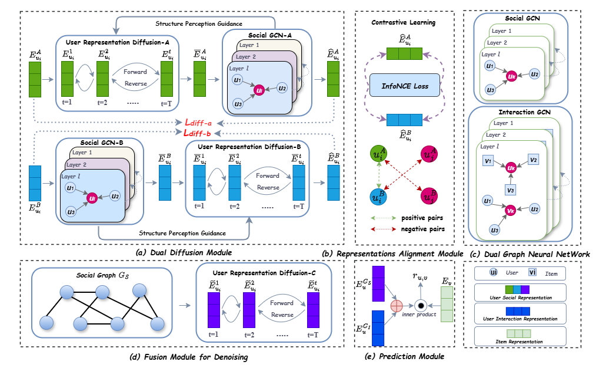

# Dual-track Diffusion: Structure-Guided High Fidelity Denoising for Social Recommendation

This is the PyTorch-based implementation for DDCSR model proposed in this paper:

## Abstract
Social recommendation incorporates social network information into personalized recommendation
systems, effectively alleviating data sparsity and cold-start problems. However, real-world social
networks often contain noise, which significantly hinders the capture of authentic social preference
information. Existing social denoising methods fall into two categories: "hard" denoising based on net-
work reconstruction (which may severely damage the original network topology) and "soft" denoising
based on user representation (which fails to fully consider node dependencies during the denoising
process). To address these limitations, we propose a Structure-Guided High Fidelity Denoising frame-
work for Social Recommendation (SGDSR). First, our framework designs a dual-diffusion mod-
ule incorporating structural information, introducing network topology constraints into the diffusion
process to effectively preserve key social information during denoising. Then, we employ contrastive
learning to align representations from dual-diffusion pathways, enhancing their consistency. Finally,
we propose a fusion-denoising mechanism that refines integrated network information to improve
representation robustness. Extensive experiments on three real-world datasets demonstrate that
SGDSR outperforms state-of-the-art baselines in social recommendation. 

## Environment
- python=3.8
- torch=1.13
- numpy=1.23.1
- scipy=1.9.1
- dgl=1.0.3+cu117

## Citation
If you find this work useful for your research, please consider citing our paper:

    